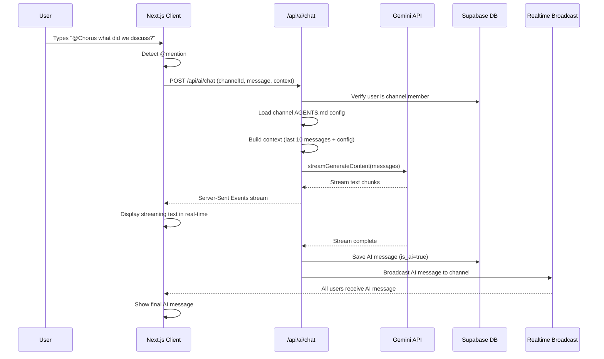
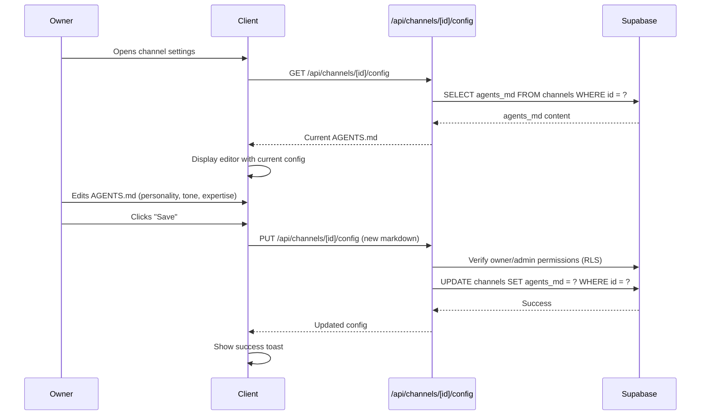

# Epic Technical Specification: AI Integration Core

Date: 2025-11-13
Author: AI Development Team
Epic ID: 2
Status: Draft

---

## Overview

Epic 2 introduces AI as a social peer within Chorus channels, transforming the platform from a standard chat application into an AI-enhanced collaborative space. This epic delivers @mention-based AI activation, conversational responses powered by Google Gemini, context-aware interactions using short-term memory, and per-channel personality configuration via AGENTS.md files. The implementation enables Stories 7-11 from the PRD, providing the foundation for "AI that feels like a friend with perfect memory" while maintaining sub-3-second response latency through streaming and caching optimizations.

## Objectives and Scope

**In Scope:**
- @mention detection and parsing (@Chorus, @AI, case-insensitive)
- Gemini API integration via Vercel AI SDK for streaming responses
- Short-term memory context (last 10-15 messages in thread)
- Conversational AI personality with friendly, non-robotic tone
- System prompt engineering for social interactions
- Per-channel AGENTS.md configuration system
- AI response streaming with typing indicators
- Prompt caching for cost efficiency
- Error handling and graceful degradation
- AI message attribution (special avatar, "AI" badge)

**Out of Scope:**
- Vector embeddings and semantic search (Epic 3)
- Knowledge graph memory (Epic 3)
- Multiple AI personas/subagents (Phase 2)
- Background research quests (Phase 2)
- Voice-to-text/text-to-speech (Phase 2)
- AI-initiated conversations (explicitly out of scope per PRD)
- Multi-model support (locked to Gemini for MVP)
- Image generation or vision capabilities
- RAG (Retrieval-Augmented Generation) beyond short-term context

## System Architecture Alignment

**Technology Stack:**
- **AI Model**: Google Gemini 2.0 Flash (via `@google/generative-ai@^0.21.0`)
- **Streaming**: Vercel AI SDK (`ai@^4.0.17`) for streaming text responses
- **Context Management**: Short-term memory window (client-side message store)
- **Configuration Storage**: AGENTS.md files stored in `channels.agents_md` column
- **API Routes**: `/api/ai/chat` for streaming completions

**Architecture Constraints:**
- AI responses must stream (no blocking full-response generation)
- Gemini prompt caching enabled for repeated context (cost optimization)
- AI only processes messages that @mention it (spam prevention)
- Context window limited to 10-15 recent messages + system prompt
- All AI API calls server-side only (API keys never exposed to client)
- Graceful fallback if Gemini API unavailable (error message, no crash)

**Integration Points:**
- **Message Service**: AI responses saved as regular messages with `is_ai=true`
- **Realtime Broadcast**: AI responses broadcast to all channel subscribers
- **Message Store**: AI responses added to Zustand message cache
- **Channel Settings**: AGENTS.md editor in channel settings UI

## Detailed Design

### Services and Modules

| Module | Responsibility | Inputs | Outputs | Owner |
|--------|----------------|--------|---------|-------|
| **Mention Parser** | Detect @AI or @Chorus mentions | Message content string | Boolean (hasAIMention) | `lib/utils/mentions.ts` |
| **Context Builder** | Build AI context from message history | Channel messages, channel config | Gemini messages array | `lib/ai/context.ts` |
| **Gemini Client** | Interface to Gemini API | Messages array, system prompt | Streaming text response | `lib/ai/gemini.ts` |
| **AGENTS.md Parser** | Parse and validate channel config | AGENTS.md markdown string | Config object (system prompt, tone, etc.) | `lib/ai/agents-config.ts` |
| **Streaming Route Handler** | Stream AI responses to client | Channel ID, message content | Server-Sent Events stream | `/api/ai/chat/route.ts` |
| **AI Message Processor** | Trigger AI on new messages | Message object | AI response message (if mentioned) | Message creation hook |
| **Typing Indicator** | Show AI is responding | Stream start event | UI typing indicator | `components/chat/AITypingIndicator.tsx` |

### Data Models and Contracts

**Message Model Extension (Existing):**

```typescript
// Database: messages table already has is_ai column
interface Message {
  id: string;
  channel_id: string;
  user_id: string | null; // null for AI messages
  content: string;
  is_ai: boolean; // true for AI-generated messages
  created_at: string;
  updated_at: string;
}
```

**Channel Model Extension (Existing):**

```typescript
// Database: channels table already has agents_md column
interface Channel {
  id: string;
  server_id: string;
  name: string;
  description: string | null;
  position: number;
  agents_md: string | null; // AGENTS.md configuration
  created_at: string;
  updated_at: string;
}
```

**AGENTS.md Configuration Format:**

```markdown
# Channel AI Configuration

## Personality
Friendly, knowledgeable software engineering mentor

## Tone
- Casual and approachable
- Uses analogies and examples
- Encourages experimentation
- No corporate jargon

## Expertise
- Software architecture
- System design
- Code review
- Best practices

## Example Responses
- "That's a great question! Let me break it down..."
- "I've seen this pattern work well in similar situations..."
- "Here's how I'd approach this..."

## Restrictions
- No financial or legal advice
- Stay focused on technical topics
- Admit when uncertain
```

**Parsed Config Object:**

```typescript
interface AgentsConfig {
  personality?: string;
  tone?: string[];
  expertise?: string[];
  exampleResponses?: string[];
  restrictions?: string[];
  customSystemPrompt?: string; // Override default entirely
}
```

**AI Chat API Request:**

```typescript
// POST /api/ai/chat
interface ChatRequest {
  channelId: string;
  messageContent: string; // The user's message that mentioned AI
  recentMessages: Message[]; // Last 10-15 messages for context
}
```

**AI Chat API Response (Streaming):**

```typescript
// Server-Sent Events stream
// Uses Vercel AI SDK toDataStreamResponse()
// Client receives incremental text chunks

// After stream completes, AI message saved to database:
{
  id: "uuid",
  channel_id: "channel-uuid",
  user_id: null,
  content: "Full AI response text",
  is_ai: true,
  created_at: "2025-11-13T10:30:00Z"
}
```

### API Specifications

**Endpoint: POST /api/ai/chat**

**Purpose:** Generate and stream AI response for an @mentioned message

**Authentication:** Required (must be channel member)

**Request:**
```typescript
{
  channelId: string;
  messageContent: string;
  recentMessages: Array<{
    id: string;
    user_id: string | null;
    content: string;
    is_ai: boolean;
    created_at: string;
  }>;
}
```

**Response:**
- Content-Type: `text/event-stream`
- Streaming text chunks via Vercel AI SDK
- Final message automatically saved to database

**Error Responses:**
- 401 Unauthorized: Not authenticated
- 403 Forbidden: Not a member of the channel
- 429 Too Many Requests: Rate limit exceeded
- 500 Internal Server Error: Gemini API failure
- 503 Service Unavailable: Gemini API down

**Rate Limits:**
- 10 AI requests per minute per user (soft limit)
- Monitor for abuse during beta

---

**Endpoint: GET /api/channels/[channelId]/config**

**Purpose:** Retrieve AGENTS.md configuration for a channel

**Authentication:** Required (must be channel member)

**Response:**
```typescript
{
  data: {
    channelId: string;
    agentsMd: string | null; // Raw markdown
    parsedConfig: AgentsConfig | null; // Parsed object
  },
  error: null
}
```

---

**Endpoint: PUT /api/channels/[channelId]/config**

**Purpose:** Update AGENTS.md configuration (owner/admin only)

**Authentication:** Required (must be server owner or admin)

**Request:**
```typescript
{
  agentsMd: string; // Markdown content
}
```

**Response:**
```typescript
{
  data: {
    channelId: string;
    agentsMd: string;
  },
  error: null
}
```

### Component Specifications

**Component: AIMessage**

**File:** `components/chat/AIMessage.tsx`

**Purpose:** Render AI-generated messages with distinct styling

**Props:**
```typescript
interface AIMessageProps {
  message: Message; // is_ai === true
  channelId: string;
}
```

**UI Features:**
- AI avatar (gradient orb or robot icon)
- "AI" badge next to name
- Distinct background color (subtle gradient)
- Markdown rendering (bold, italic, code blocks, links)
- Timestamp in local timezone

---

**Component: AITypingIndicator**

**File:** `components/chat/AITypingIndicator.tsx`

**Purpose:** Show when AI is generating a response

**Props:**
```typescript
interface AITypingIndicatorProps {
  isTyping: boolean;
}
```

**UI Features:**
- Animated "..." dots
- "Chorus is typing..." text
- Fades in/out smoothly
- Positioned at bottom of message list

---

**Component: AgentsConfigEditor**

**File:** `components/chat/AgentsConfigEditor.tsx`

**Purpose:** Edit AGENTS.md configuration in channel settings

**Props:**
```typescript
interface AgentsConfigEditorProps {
  channelId: string;
  initialConfig: string | null;
  onSave: (config: string) => void;
}
```

**UI Features:**
- Textarea with markdown syntax highlighting
- Preview pane showing parsed config
- Save/Cancel buttons
- Validation feedback (e.g., invalid markdown)
- Only visible to server owner/admin

### User Flows and Interactions

**Flow 1: User Mentions AI and Receives Response**



**Flow 2: Server Owner Configures Channel AI Personality**



### Integration Points

**1. Message Creation Flow Integration**

When a message is created in a channel:
1. Message saved to database (existing flow)
2. Broadcast to all channel subscribers (existing flow)
3. **NEW:** Check if message mentions AI (`@Chorus` or `@AI`)
4. **NEW:** If yes, trigger `/api/ai/chat` with message context
5. **NEW:** Stream AI response back to channel

**Implementation Location:**
- `app/api/channels/[channelId]/messages/route.ts` (existing POST handler)
- Add mention detection after successful message save
- Trigger AI chat via server-side fetch (no client round-trip)

**2. Message Display Integration**

Existing MessageList component must differentiate AI messages:
- Check `message.is_ai` flag
- Render `<AIMessage>` instead of `<Message>` if true
- Apply distinct styling (AI avatar, badge, background)

**Implementation Location:**
- `components/chat/MessageList.tsx` (existing component)
- Add conditional rendering: `{message.is_ai ? <AIMessage /> : <Message />}`

**3. Zustand Store Integration**

AI messages added to existing message store:
- No schema changes needed (already handles all messages)
- AI messages indexed by channel_id like user messages

**Implementation Location:**
- `store/use-chat-store.ts` (no changes needed, already handles all messages)

**4. Realtime Broadcast Integration**

AI messages broadcast via existing infrastructure:
- AI response saved to DB with `is_ai=true`
- Broadcast event sent with message payload
- All clients receive and display AI message

**Implementation Location:**
- `/api/ai/chat/route.ts` (new file) handles broadcast after AI response

### Performance Considerations

**Target Metrics (from PRD):**
- AI response latency: < 3 seconds (p95) for first token
- Full response: < 10 seconds for typical response
- Context building: < 100ms
- AGENTS.md parsing: < 50ms

**Optimization Strategies:**

1. **Prompt Caching (Gemini Feature):**
   - Cache static system prompt + channel config
   - Reduces API costs by ~50% for repeated context
   - Implementation: Use Gemini's cachedContent API

2. **Streaming Responses:**
   - Use Vercel AI SDK `streamText()` for incremental delivery
   - Display first token within 1-2 seconds
   - Improves perceived performance

3. **Context Window Limit:**
   - Limit to 10-15 most recent messages (not entire channel history)
   - Reduces token count, faster processing
   - Epic 3 will add semantic retrieval for older messages

4. **Debounced Typing Indicator:**
   - Only show typing indicator after 500ms delay
   - Prevents flashing for instant responses

5. **Error Fallback:**
   - If Gemini API timeout (>10s), show friendly error
   - Allow retry without re-sending user message
   - Log failures for monitoring

### Security and Privacy

**Security Measures:**

1. **API Key Protection:**
   - `GEMINI_API_KEY` stored in server-side environment only
   - Never exposed to client code
   - Validated on server startup

2. **Authorization:**
   - Verify user is channel member before processing AI request
   - RLS policies prevent unauthorized channel access
   - AGENTS.md editing restricted to server owner/admin

3. **Input Validation:**
   - Sanitize user messages before sending to Gemini
   - Limit message content length (max 2000 chars)
   - Validate AGENTS.md format (max 10KB file size)

4. **Rate Limiting:**
   - Soft limit: 10 AI requests/min per user
   - Hard limit: 100 AI requests/hour per user
   - Monitor for abuse, ban if necessary

5. **Content Moderation:**
   - Rely on Gemini's built-in safety filters (hate, harassment, dangerous content)
   - Log flagged content for review
   - Future: Add custom content filtering if needed

**Privacy Considerations:**

1. **Data Sent to Gemini:**
   - Only last 10-15 messages + current message
   - No user emails, passwords, or sensitive metadata
   - Channel names and usernames included (not PII)

2. **Data Retention:**
   - AI responses stored in messages table (same as user messages)
   - Subject to same data deletion policies
   - User can delete account → all messages deleted (CASCADE)

3. **Google's Data Usage:**
   - Gemini API processes chat history for response generation
   - Google does NOT use customer data to train models (per Gemini Cloud ToS)
   - Data not retained by Google after processing (per ToS)

### Error Handling

**Error Scenarios and Responses:**

| Error | Cause | User Experience | Logging |
|-------|-------|-----------------|---------|
| **Gemini API Timeout** | API takes > 10s to respond | "AI is taking longer than usual. Please try again." | Log timeout, retry count |
| **Gemini API 429 (Rate Limit)** | Too many requests to API | "AI is busy right now. Please wait a moment." | Alert if sustained |
| **Gemini API 500 (Server Error)** | Google's infrastructure issue | "AI is temporarily unavailable. Try again later." | Alert immediately |
| **Invalid AGENTS.md** | Malformed markdown or config | "Configuration error. Please check AGENTS.md syntax." | Log invalid config |
| **No API Key** | Missing `GEMINI_API_KEY` env var | App fails to start (graceful error in dev) | Fatal error, exit process |
| **User Not Channel Member** | Unauthorized API access | 403 Forbidden (API) | Log suspicious activity |
| **Context Too Large** | > 15 messages or > 10K tokens | Truncate to last 10 messages | Log warning |

**Graceful Degradation:**

- If Gemini unavailable, AI features disabled (no crash)
- Show banner: "AI features temporarily unavailable"
- Users can still chat normally (Epic 1 features unaffected)
- Retry failed AI requests with exponential backoff (2s, 4s, 8s)

## Implementation Plan

### User Stories and Acceptance Criteria

**Story 7: @mention AI Activation**

**As a user, I want to @mention the AI in chat so I can get AI responses without spam**

**Acceptance Criteria:**

**AC 7.1:** Typing `@Chorus` or `@AI` triggers autocomplete
- Given: User is in a channel
- When: User types `@C` or `@A`
- Then: Autocomplete menu shows "Chorus (AI)" option
- And: Selecting option inserts `@Chorus` mention

**AC 7.2:** AI only processes messages that @mention it
- Given: User sends message "Hello everyone"
- When: Message does not contain @mention
- Then: AI does not generate response
- And: No AI API call is made

**AC 7.3:** @mention detection is case-insensitive
- Given: User sends "@chorus", "@CHORUS", or "@Chorus"
- When: Any variant is used
- Then: AI processes the message
- And: Generates appropriate response

**AC 7.4:** AI response appears as regular chat message
- Given: User sends "@Chorus what's the weather?"
- When: AI generates response
- Then: Response appears in message list
- And: Has AI avatar, "AI" badge, and timestamp
- And: Is visually distinct from user messages

**Implementation Tasks:**
- [ ] Create `lib/utils/mentions.ts` with `mentionsAI()` function (regex: `/@(chorus|ai)\b/i`)
- [ ] Add mention detection to message creation handler
- [ ] Update autocomplete component to include "Chorus (AI)" option
- [ ] Create `components/chat/AIMessage.tsx` with distinct styling
- [ ] Add AI message rendering logic to `MessageList.tsx`

**Testing:**
- Unit test: `mentionsAI()` with various inputs (@Chorus, @chorus, @AI, @ai, no mention)
- E2E test: Send message with @mention → Verify AI response appears
- E2E test: Send message without @mention → Verify no AI response

---

**Story 8: Conversational AI Responses**

**As a user, I want AI responses to feel conversational so it feels like a friend, not a chatbot**

**Acceptance Criteria:**

**AC 8.1:** AI uses casual, friendly tone
- Given: User asks "@Chorus what do you think about React?"
- When: AI generates response
- Then: Response uses conversational language ("I think...", "In my experience...")
- And: No corporate jargon or robotic phrases ("How may I assist you?")

**AC 8.2:** AI references previous messages naturally
- Given: User previously discussed Next.js in channel
- When: User asks "@Chorus should I use Next.js for this project?"
- Then: AI response references earlier discussion ("As we talked about earlier...")
- And: Context is incorporated naturally

**AC 8.3:** AI admits uncertainty when appropriate
- Given: User asks "@Chorus what's the meaning of life?"
- When: Question is outside AI's expertise
- Then: AI responds with uncertainty ("That's a deep question! I'm not sure...")
- And: Suggests alternative approach or defers to user's judgment

**AC 8.4:** AI personality matches channel context (via AGENTS.md)
- Given: Channel has AGENTS.md with "expert software architect" personality
- When: User asks technical question
- Then: AI responds with appropriate expertise level
- And: Tone matches configured personality

**Implementation Tasks:**
- [ ] Create default system prompt emphasizing conversational tone
- [ ] Implement AGENTS.md parser (`lib/ai/agents-config.ts`)
- [ ] Add system prompt customization based on channel config
- [ ] Test prompt engineering with various personas
- [ ] Create prompt examples for different personalities (docs)

**Testing:**
- Manual test: Verify responses feel natural (subjective, requires human review)
- Manual test: Configure different AGENTS.md files → Verify personality changes
- E2E test: Verify AGENTS.md configuration persists across sessions

---

**Story 9: AI Understands Conversation Context**

**As a user, I want the AI to understand conversation context so responses make sense**

**Acceptance Criteria:**

**AC 9.1:** AI considers last 10-15 messages in thread
- Given: Channel has 20 messages discussing database design
- When: User asks "@Chorus what do you recommend?"
- Then: AI context includes last 10-15 messages
- And: Response considers recent discussion
- And: Older messages (16+) not included in context

**AC 9.2:** AI references earlier messages when relevant
- Given: User1 said "I'm using PostgreSQL" 5 messages ago
- When: User2 asks "@Chorus what database should we use?"
- Then: AI response mentions "User1 is already using PostgreSQL"
- And: Provides context-aware recommendation

**AC 9.3:** AI doesn't repeat information just mentioned
- Given: User just said "I tried approach A and it failed"
- When: User asks "@Chorus what should I try next?"
- Then: AI response does not re-explain approach A
- And: Suggests alternative approaches (B, C, etc.)

**AC 9.4:** Context includes who said what
- Given: Multiple users in conversation
- When: AI generates response
- Then: AI knows which user said which message
- And: Can attribute ideas to specific users ("As Alice mentioned...")

**Implementation Tasks:**
- [ ] Create `lib/ai/context.ts` with `buildContext()` function
- [ ] Implement message windowing (last 10-15 messages)
- [ ] Format context as Gemini messages array with user roles
- [ ] Include message metadata (username, timestamp) in context
- [ ] Test context building with various message histories

**Testing:**
- Unit test: `buildContext()` with 20 messages → Returns last 10-15
- Unit test: Verify message format (role, content, username)
- E2E test: Send 15 messages → @mention AI → Verify response considers context
- E2E test: Verify AI response references specific user's earlier message

---

**Story 10: Fast AI Response Latency**

**As a user, I want AI responses to arrive quickly so the conversation flows naturally**

**Acceptance Criteria:**

**AC 10.1:** AI response starts appearing within 3 seconds (p95)
- Given: User sends "@Chorus tell me about React hooks"
- When: Message is submitted
- Then: Typing indicator appears within 500ms
- And: First text token arrives within 3 seconds (p95)
- And: Response continues streaming smoothly

**AC 10.2:** Streaming response shows typing indicator
- Given: AI is generating response
- When: Response is in progress
- Then: "Chorus is typing..." indicator visible
- And: Indicator shows animated dots
- And: Indicator disappears when response complete

**AC 10.3:** Partial response visible as AI generates
- Given: AI is streaming long response
- When: First tokens arrive
- Then: Partial text visible in message bubble
- And: Text updates incrementally as stream continues
- And: User can read beginning while AI finishes

**AC 10.4:** Full response completes within 10 seconds
- Given: User asks typical question
- When: AI generates response
- Then: Complete response delivered within 10 seconds
- And: No timeout errors for normal queries

**Implementation Tasks:**
- [ ] Integrate Vercel AI SDK `streamText()` function
- [ ] Create `/api/ai/chat/route.ts` with streaming handler
- [ ] Implement client-side stream reader (Vercel AI SDK `useChat` hook)
- [ ] Add typing indicator component (`AITypingIndicator.tsx`)
- [ ] Enable Gemini prompt caching for performance
- [ ] Add timeout handling (10s max) with error message

**Testing:**
- Performance test: Measure time to first token (target: <3s p95)
- Performance test: Measure full response time (target: <10s)
- E2E test: Verify typing indicator appears and disappears correctly
- E2E test: Verify partial text updates during streaming
- Load test: Verify performance with 10 concurrent AI requests

---

**Story 11: AGENTS.md Per-Channel Configuration**

**As a developer, I want to configure AI personality per channel so different topics get appropriate tone**

**Acceptance Criteria:**

**AC 11.1:** Each channel can have AGENTS.md file
- Given: User is server owner
- When: User opens channel settings
- Then: "AI Configuration" tab is visible
- And: Editor shows current AGENTS.md content (or empty if none)

**AC 11.2:** File contains system prompt, tone, domain expertise
- Given: User edits AGENTS.md
- When: User defines personality, tone, expertise sections
- Then: Configuration is saved to `channels.agents_md` column
- And: Markdown is parsed into structured config object

**AC 11.3:** AI behavior changes based on channel's AGENTS.md
- Given: Channel A has "casual friend" personality
- And: Channel B has "expert architect" personality
- When: User asks same question in both channels
- Then: AI responses have different tones
- And: Expertise level differs appropriately

**AC 11.4:** Falls back to default personality if no config
- Given: Channel has no AGENTS.md configured
- When: User @mentions AI
- Then: AI uses default conversational personality
- And: Response is friendly and helpful (generic tone)

**Implementation Tasks:**
- [ ] Add "AI Configuration" tab to channel settings modal
- [ ] Create `AgentsConfigEditor.tsx` component (markdown editor + preview)
- [ ] Create `/api/channels/[id]/config` endpoint (GET/PUT)
- [ ] Implement AGENTS.md parser with validation
- [ ] Integrate parsed config into system prompt builder
- [ ] Create default system prompt for channels without config
- [ ] Add AGENTS.md examples to documentation

**Testing:**
- E2E test: Create channel → Add AGENTS.md → Verify AI uses config
- E2E test: Update AGENTS.md → Verify AI behavior changes
- E2E test: Delete AGENTS.md → Verify fallback to default
- Unit test: AGENTS.md parser with valid/invalid markdown
- Manual test: Verify different personalities in different channels

### Technical Implementation Details

**1. Gemini API Integration**

**File:** `lib/ai/gemini.ts`

```typescript
import { GoogleGenerativeAI } from '@google/generative-ai';

const genAI = new GoogleGenerativeAI(process.env.GEMINI_API_KEY!);

export async function streamChatCompletion(
  messages: Array<{ role: 'user' | 'model'; parts: string }>,
  systemPrompt: string
) {
  const model = genAI.getGenerativeModel({
    model: 'gemini-2.0-flash-exp',
    systemInstruction: systemPrompt,
  });

  const chat = model.startChat({
    history: messages.slice(0, -1), // All except last message
    generationConfig: {
      temperature: 0.7,
      topP: 0.95,
      maxOutputTokens: 2048,
    },
  });

  const result = await chat.sendMessageStream(messages[messages.length - 1].parts);
  return result.stream;
}
```

**2. Context Builder**

**File:** `lib/ai/context.ts`

```typescript
import { Message } from '@/types';

export function buildContext(
  recentMessages: Message[],
  currentMessage: string,
  maxMessages: number = 10
): Array<{ role: 'user' | 'model'; parts: string }> {
  // Take last N messages
  const context = recentMessages.slice(-maxMessages);

  // Format as Gemini messages
  const formattedMessages = context.map((msg) => ({
    role: msg.is_ai ? 'model' : 'user',
    parts: msg.is_ai
      ? msg.content
      : `${msg.user?.username || 'User'}: ${msg.content}`,
  }));

  // Add current message
  formattedMessages.push({
    role: 'user',
    parts: currentMessage,
  });

  return formattedMessages;
}
```

**3. AGENTS.md Parser**

**File:** `lib/ai/agents-config.ts`

```typescript
import { remark } from 'remark';
import { visit } from 'unist-util-visit';

export interface AgentsConfig {
  personality?: string;
  tone?: string[];
  expertise?: string[];
  restrictions?: string[];
  customSystemPrompt?: string;
}

export function parseAgentsMd(markdown: string | null): AgentsConfig {
  if (!markdown) return {};

  const config: AgentsConfig = {};

  // Parse markdown headings and extract sections
  const tree = remark().parse(markdown);
  let currentSection: string | null = null;

  visit(tree, (node) => {
    if (node.type === 'heading' && node.depth === 2) {
      currentSection = node.children[0]?.value?.toLowerCase();
    } else if (node.type === 'paragraph' && currentSection) {
      const text = extractText(node);
      if (currentSection === 'personality') {
        config.personality = text;
      }
    } else if (node.type === 'list' && currentSection) {
      const items = extractListItems(node);
      if (currentSection === 'tone') config.tone = items;
      if (currentSection === 'expertise') config.expertise = items;
      if (currentSection === 'restrictions') config.restrictions = items;
    }
  });

  return config;
}

export function buildSystemPrompt(config: AgentsConfig): string {
  if (config.customSystemPrompt) {
    return config.customSystemPrompt;
  }

  const parts = [
    "You are Chorus, an AI assistant participating in a group chat.",
    "Your goal is to be helpful, conversational, and feel like a friend with perfect memory.",
  ];

  if (config.personality) {
    parts.push(`\nPersonality: ${config.personality}`);
  }

  if (config.tone && config.tone.length > 0) {
    parts.push(`\nTone guidelines:\n${config.tone.map(t => `- ${t}`).join('\n')}`);
  }

  if (config.expertise && config.expertise.length > 0) {
    parts.push(`\nExpertise areas:\n${config.expertise.map(e => `- ${e}`).join('\n')}`);
  }

  if (config.restrictions && config.restrictions.length > 0) {
    parts.push(`\nRestrictions:\n${config.restrictions.map(r => `- ${r}`).join('\n')}`);
  }

  parts.push("\nBe concise, natural, and reference conversation context when relevant.");

  return parts.join('\n');
}
```

**4. Streaming API Route**

**File:** `app/api/ai/chat/route.ts`

```typescript
import { NextRequest, NextResponse } from 'next/server';
import { createClient } from '@/lib/supabase/server';
import { streamChatCompletion } from '@/lib/ai/gemini';
import { buildContext } from '@/lib/ai/context';
import { parseAgentsMd, buildSystemPrompt } from '@/lib/ai/agents-config';

export async function POST(req: NextRequest) {
  try {
    const supabase = createClient(req.cookies);
    const { channelId, messageContent, recentMessages } = await req.json();

    // 1. Verify user is channel member (RLS will handle this)
    const { data: channel, error: channelError } = await supabase
      .from('channels')
      .select('id, agents_md')
      .eq('id', channelId)
      .single();

    if (channelError || !channel) {
      return NextResponse.json({ error: 'Unauthorized' }, { status: 403 });
    }

    // 2. Build context from recent messages
    const context = buildContext(recentMessages, messageContent);

    // 3. Load and parse AGENTS.md config
    const config = parseAgentsMd(channel.agents_md);
    const systemPrompt = buildSystemPrompt(config);

    // 4. Stream response from Gemini
    const stream = await streamChatCompletion(context, systemPrompt);

    // 5. Convert to ReadableStream and return
    const readableStream = new ReadableStream({
      async start(controller) {
        let fullResponse = '';

        for await (const chunk of stream) {
          const text = chunk.text();
          fullResponse += text;
          controller.enqueue(new TextEncoder().encode(text));
        }

        // 6. Save AI message to database after stream completes
        const { data: user } = await supabase.auth.getUser();
        await supabase.from('messages').insert({
          channel_id: channelId,
          user_id: null, // AI has no user_id
          content: fullResponse,
          is_ai: true,
        });

        controller.close();
      },
    });

    return new NextResponse(readableStream, {
      headers: {
        'Content-Type': 'text/event-stream',
        'Cache-Control': 'no-cache',
        'Connection': 'keep-alive',
      },
    });
  } catch (error) {
    console.error('AI chat error:', error);
    return NextResponse.json(
      { error: 'AI service unavailable' },
      { status: 500 }
    );
  }
}
```

**5. Client-Side Integration**

**File:** `components/chat/MessageInput.tsx` (Modified)

```typescript
'use client';

import { useState } from 'react';
import { createClient } from '@/lib/supabase/client';
import { mentionsAI } from '@/lib/utils/mentions';
import { useChatStore } from '@/store/use-chat-store';

export function MessageInput({ channelId }: { channelId: string }) {
  const [content, setContent] = useState('');
  const [isAIResponding, setIsAIResponding] = useState(false);
  const messages = useChatStore((s) => s.messages[channelId] || []);
  const addMessage = useChatStore((s) => s.addMessage);

  const handleSubmit = async (e: React.FormEvent) => {
    e.preventDefault();
    if (!content.trim()) return;

    const supabase = createClient();

    // 1. Send user message
    const { data: newMessage } = await supabase
      .from('messages')
      .insert({ channel_id: channelId, content })
      .select()
      .single();

    if (newMessage) {
      addMessage(channelId, newMessage);
    }

    setContent('');

    // 2. Check if AI was mentioned
    if (mentionsAI(content)) {
      setIsAIResponding(true);

      try {
        // 3. Call AI chat endpoint with context
        const response = await fetch('/api/ai/chat', {
          method: 'POST',
          headers: { 'Content-Type': 'application/json' },
          body: JSON.stringify({
            channelId,
            messageContent: content,
            recentMessages: messages.slice(-10), // Last 10 for context
          }),
        });

        // 4. Stream AI response
        const reader = response.body?.getReader();
        const decoder = new TextDecoder();
        let aiResponse = '';

        while (true) {
          const { done, value } = await reader!.read();
          if (done) break;

          const chunk = decoder.decode(value);
          aiResponse += chunk;

          // Update UI with partial response (optimistic)
          addMessage(channelId, {
            id: 'temp-ai',
            channel_id: channelId,
            user_id: null,
            content: aiResponse,
            is_ai: true,
            created_at: new Date().toISOString(),
          });
        }
      } catch (error) {
        console.error('AI response error:', error);
        // Show error message in UI
      } finally {
        setIsAIResponding(false);
      }
    }
  };

  return (
    <form onSubmit={handleSubmit}>
      <input
        value={content}
        onChange={(e) => setContent(e.target.value)}
        placeholder="Type a message... (@Chorus to ask AI)"
      />
      {isAIResponding && <AITypingIndicator />}
    </form>
  );
}
```

### Dependencies and Prerequisites

**New Dependencies:**

```json
{
  "dependencies": {
    "@google/generative-ai": "^0.21.0",
    "ai": "^4.0.17",
    "remark": "^15.0.1",
    "remark-gfm": "^4.0.0",
    "unist-util-visit": "^5.0.0"
  }
}
```

**Environment Variables:**

```bash
# Required for Epic 2
GEMINI_API_KEY=your_gemini_api_key_here
```

**Prerequisites from Epic 1:**
- ✅ Database schema with `messages.is_ai` column
- ✅ Database schema with `channels.agents_md` column
- ✅ Message creation API (`/api/channels/[id]/messages`)
- ✅ Realtime Broadcast infrastructure
- ✅ Zustand message store
- ✅ Authentication and RLS policies

### Testing Strategy

**Unit Tests:**
- [ ] `mentionsAI()` function (various inputs, edge cases)
- [ ] `buildContext()` function (message windowing, formatting)
- [ ] `parseAgentsMd()` function (valid/invalid markdown)
- [ ] `buildSystemPrompt()` function (config variations)

**Integration Tests:**
- [ ] `/api/ai/chat` endpoint (authorized user, streaming response)
- [ ] `/api/channels/[id]/config` endpoint (GET/PUT, authorization)
- [ ] AI message saved to database after streaming completes

**E2E Tests (Playwright):**
- [ ] User sends message with @mention → AI responds
- [ ] User sends message without @mention → No AI response
- [ ] AI response streams (typing indicator, partial text)
- [ ] Channel owner configures AGENTS.md → AI behavior changes
- [ ] Multiple users in channel → AI references correct usernames

**Performance Tests:**
- [ ] Measure time to first token (target: <3s p95)
- [ ] Measure full response time (target: <10s average)
- [ ] Load test: 10 concurrent AI requests (no degradation)

**Manual Tests:**
- [ ] Subjective response quality (conversational tone)
- [ ] Different AGENTS.md personalities (expert, casual, technical)
- [ ] Error handling (Gemini timeout, invalid config)

### Risks and Mitigations

| Risk | Impact | Probability | Mitigation |
|------|--------|-------------|------------|
| **Gemini API costs exceed budget** | High | Medium | @mention activation limits calls; prompt caching reduces costs 50%; monitor usage dashboard |
| **Response latency > 3s** | High | Low | Streaming shows progress instantly; optimize context window; enable prompt caching |
| **Gemini API downtime** | Medium | Low | Graceful fallback (error message); retry logic; status banner if sustained |
| **AI responses feel robotic** | High | Medium | Extensive prompt engineering; AGENTS.md customization; beta user feedback |
| **Users spam @mentions** | Medium | Medium | Rate limiting (10/min); monitor abuse; soft limits for beta |
| **AGENTS.md misconfiguration** | Low | Medium | Validation + error messages; fallback to default; examples in docs |
| **Context window too small** | Medium | Low | Start with 10-15 messages; Epic 3 adds semantic retrieval for history |

### Open Questions and Decisions

**Q1: Should AI responses be editable/deletable?**
- **Decision:** Yes, by server owner/admin only
- **Rationale:** Allows moderation of inappropriate responses
- **Implementation:** Add admin controls in message actions menu

**Q2: Should we support multiple AI personas per server?**
- **Decision:** Not in Epic 2 (deferred to Phase 2)
- **Rationale:** Adds complexity; MVP focuses on single AI per channel
- **Future:** Epic 6 will add @ResearchBot, @DevilsAdvocate subagents

**Q3: How do we handle very long AI responses (>2000 chars)?**
- **Decision:** Truncate at 2048 tokens (Gemini limit)
- **Rationale:** Encourages concise responses; matches chat UX
- **Future:** Add "Continue..." button for longer responses if needed

**Q4: Should AI have access to message history beyond 10-15 messages?**
- **Decision:** Not in Epic 2 (Epic 3 adds semantic search)
- **Rationale:** Keeps costs low; Epic 3 vector search solves long-term memory
- **Implementation:** Epic 3 will integrate vector retrieval into context builder

**Q5: How do we prevent prompt injection attacks?**
- **Decision:** Rely on Gemini's built-in protections; sanitize user input
- **Rationale:** Google's safety filters handle most attacks
- **Future:** Add custom filtering if exploits discovered in beta

## Acceptance Criteria Summary

**Epic 2 is complete when:**

1. ✅ Users can @mention AI and receive conversational responses
2. ✅ AI responses stream with <3s latency to first token (p95)
3. ✅ AI considers last 10-15 messages for context
4. ✅ AI tone is friendly and natural (not robotic)
5. ✅ Server owners can configure AGENTS.md per channel
6. ✅ AI behavior adapts to channel configuration
7. ✅ All 5 user stories (7-11) acceptance criteria met
8. ✅ E2E tests pass for critical AI flows
9. ✅ Error handling graceful (Gemini timeout/downtime)
10. ✅ Rate limiting prevents abuse (10 req/min)

**Success Metrics (Post-Deployment):**
- 80%+ of users @mention AI at least once in first week
- Average AI response latency < 3s (p95)
- < 5% AI error rate (timeouts, failures)
- Users report "AI feels conversational" in feedback
- AGENTS.md used in 30%+ of active channels

## Dependencies on Other Epics

**Depends on Epic 1 (Complete):**
- ✅ Database schema (`messages.is_ai`, `channels.agents_md`)
- ✅ Message creation and broadcast infrastructure
- ✅ Authentication and RLS policies
- ✅ Zustand message store

**Enables Epic 3:**
- 🔜 AI chat infrastructure (Epic 3 will add vector search to context)
- 🔜 Message processing pipeline (Epic 3 adds embedding generation)

**Enables Epic 4:**
- 🔜 AI responses (Epic 4 will render Mermaid diagrams from AI)
- 🔜 Markdown rendering (Epic 4 adds syntax highlighting to AI code blocks)

## Rollout Strategy

**Phase 1: Internal Testing (Week 1)**
- Deploy Epic 2 to staging environment
- Internal team testing with various @mention scenarios
- Verify streaming, context, AGENTS.md configuration
- Performance testing (latency, concurrent requests)

**Phase 2: Closed Beta (Week 2-3)**
- Enable for existing beta users (10-20 people)
- Monitor API usage, costs, error rates
- Collect qualitative feedback on AI personality
- Iterate on system prompts based on feedback

**Phase 3: Refinement (Week 4)**
- Adjust default system prompt based on feedback
- Add AGENTS.md examples to documentation
- Fix bugs discovered in beta
- Performance optimization if needed

**Phase 4: Production (Week 5)**
- Deploy to production
- Monitor metrics (latency, error rate, usage)
- Prepare for Epic 3 (Smart Memory System)

## Appendix

### Default System Prompt (No AGENTS.md)

```
You are Chorus, an AI assistant participating in a group chat.

Your goal is to be helpful, conversational, and feel like a friend with perfect memory. You're not a productivity tool or corporate assistant – you're a social peer who happens to have great recall.

Guidelines:
- Be casual and friendly (use "I think...", "In my experience...", etc.)
- Reference earlier messages when relevant ("As Alice mentioned...")
- Admit uncertainty honestly ("I'm not sure about that...")
- Keep responses concise (2-3 paragraphs max for most questions)
- Use analogies and examples to explain complex topics
- Encourage follow-up questions and discussion
- Avoid corporate jargon, excessive formality, or robotic phrases

You have access to the last 10-15 messages in this conversation. Use this context to provide relevant, thoughtful responses that build on the ongoing discussion.

Remember: You're here to enhance the conversation, not dominate it. Be a helpful participant, not a lecturer.
```

### Example AGENTS.md Configurations

**Example 1: Software Engineering Mentor**

```markdown
# AI Configuration: Engineering Mentor

## Personality
Experienced software engineer with 10+ years building production systems. Patient teacher who loves helping others learn.

## Tone
- Casual and approachable
- Uses real-world examples and war stories
- Encourages experimentation and learning from mistakes
- Celebrates small wins

## Expertise
- Software architecture and system design
- Code review and best practices
- Debugging and troubleshooting
- Performance optimization
- Career advice for developers

## Restrictions
- No financial or legal advice
- Avoid being prescriptive ("you must do X") – offer options
- Don't write complete production code (snippets OK)
```

**Example 2: D&D Campaign Assistant**

```markdown
# AI Configuration: D&D Companion

## Personality
Enthusiastic Dungeon Master's assistant who loves storytelling and world-building. Keeps lore organized and helps players remember plot threads.

## Tone
- Excited and imaginative
- Uses fantasy language when appropriate
- Supportive of player creativity
- Keeps track of campaign details

## Expertise
- D&D 5e rules and mechanics
- Campaign lore and continuity
- NPC personalities and motivations
- World-building suggestions

## Restrictions
- Defer to DM for final rulings
- Don't spoil surprises or reveal hidden information
- Avoid rules lawyering – focus on fun
```

**Example 3: Technical Book Club**

```markdown
# AI Configuration: Book Discussion Facilitator

## Personality
Thoughtful moderator who asks probing questions and connects ideas across chapters and books.

## Tone
- Curious and analytical
- Asks open-ended questions
- Synthesizes different viewpoints
- References other books when relevant

## Expertise
- Software engineering books and papers
- Patterns and anti-patterns in code
- Historical context for technical decisions
- Connecting theory to practice

## Restrictions
- Don't spoil upcoming chapters
- Avoid being overly academic
- Respect different interpretations
```

### Monitoring and Observability

**Metrics to Track:**

1. **Latency:**
   - Time to first token (p50, p95, p99)
   - Full response time (p50, p95, p99)
   - Context building time

2. **Usage:**
   - AI requests per hour/day
   - AI requests per user
   - Most active channels (by AI usage)
   - @mention detection rate (mentions / total messages)

3. **Costs:**
   - Gemini API spend per day
   - Cost per AI interaction
   - Prompt caching hit rate

4. **Errors:**
   - Gemini timeout rate
   - Gemini 429 rate limit errors
   - Gemini 500 errors
   - Invalid AGENTS.md configs

5. **Quality:**
   - Average response length
   - User feedback (thumbs up/down)
   - Retry rate (users re-asking same question)

**Alerting:**
- Alert if p95 latency > 5s (degraded performance)
- Alert if error rate > 5% (API issues)
- Alert if cost per interaction > $0.02 (budget concern)
- Alert if Gemini API down for > 5 minutes

### Documentation Requirements

**User-Facing Docs:**
- [ ] How to @mention the AI (quick start guide)
- [ ] AGENTS.md configuration guide with examples
- [ ] AI personality customization best practices
- [ ] Privacy: What data is sent to Gemini

**Developer Docs:**
- [ ] AI integration architecture overview
- [ ] How to modify system prompts
- [ ] How to add new AI models (future)
- [ ] Debugging AI responses (logs, traces)

**Deployment Docs:**
- [ ] Gemini API key setup (Google Cloud Console)
- [ ] Environment variable configuration
- [ ] Monitoring dashboard setup (Vercel Analytics)
- [ ] Cost monitoring and alerts

---

**Epic Status:** Draft
**Last Updated:** 2025-11-13
**Next Review:** After Epic 1 deployment feedback
**Estimated Effort:** 2-3 weeks (1 developer)
