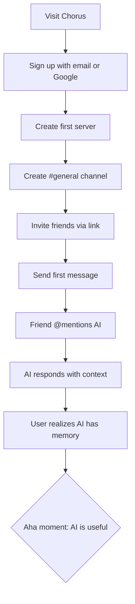
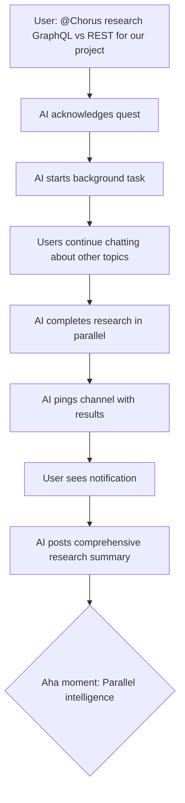

# Product Requirements Document: Chorus

**Document Version:** 1.0  
**Date:** 2025-11-13  
**Author:** Product Manager Agent  
**Project:** Chorus - AI-Enhanced Social Chat Platform  
**Status:** Draft → Ready for Review

---

## Document Control

| Version | Date | Author | Changes |
|---------|------|--------|---------|
| 1.0 | 2025-11-13 | PM Agent | Initial PRD based on Product Brief |

**Related Documents:**
- [Product Brief: Chorus](product-brief-chorus-2025-11-13.md)
- [Brainstorming Session Results](brainstorming-session-results-2025-11-12.md)

**Stakeholders:**
- Product Owner: Berkay
- Development Team: TBD
- Early Beta Users: Tech community (10-20 users)

---

## Executive Summary

**Chorus** is a Discord-like real-time chat platform where AI participates as a social peer with perfect memory. The platform transforms casual group conversations into a living knowledge base by combining three-tier memory architecture (short-term + vector embeddings + knowledge graph) with natural @mention-based AI interaction.

**Primary Goal:** Create the first social chat platform where AI feels like a friend with perfect memory, not a productivity assistant.

**Success Metric:** Users return 3+ times in first week and report "AI actually remembered context" moments.

**MVP Timeline:** 8-12 weeks to beta launch with 10-20 users.

---

## Product Overview

### Problem Statement

Friend groups and communities generate valuable collective intelligence through conversation—emergent insights, connections between ideas, shared context that no individual would reach alone. **This intelligence evaporates** because:

1. Human memory is lossy
2. Key insights get buried in chat history
3. Patterns across conversations go unnoticed
4. Context is constantly rebuilt from scratch
5. The group repeatedly discusses ideas they explored but forgot about

**Moment of Frustration:** "I know we talked about this before... but I can't remember what we decided."

### Product Vision

A real-time chat platform where:
- AI participates naturally via @mention (like a friend who happens to have perfect memory)
- Every conversation automatically builds toward collective intelligence
- Users can ask "what did we say about X?" and get contextual answers
- The system gets smarter over time without manual effort
- It feels fun and social, never like a productivity tool

### Key Differentiators

| Feature | Chorus | Discord/Slack | ChatGPT/Claude |
|---------|--------|---------------|----------------|
| AI as social participant | ✅ @mention activation | ❌ Bots feel mechanical | ❌ Isolated instances |
| Perfect conversation memory | ✅ Three-tier architecture | ❌ Search only | ❌ No persistent context |
| Personality per channel | ✅ AGENTS.md config | ⚠️ Limited bot config | ❌ Single personality |
| Progressive intelligence | ✅ Flywheel effect | ❌ Static experience | ❌ Each chat resets |
| Fun-first philosophy | ✅ Social experience | ✅ Social platform | ❌ Productivity focus |

---

## Target Users & Personas

### Primary Persona: "Tech Community Dan"

**Demographics:**
- Age: 25-40
- Occupation: Software developer, tech enthusiast, or student
- Location: Global, English-speaking

**Behaviors:**
- Uses Discord/Slack daily for community discussions
- Comfortable with technical concepts (embeddings, APIs, etc.)
- Participates in 3-5 active chat groups
- Generates 20-50 messages per day across communities

**Pain Points:**
- Loses track of good ideas discussed weeks ago
- Repeats conversations unknowingly
- Can't recall "what did we decide about X?"
- Wishes for searchable, contextual conversation history

**Goals:**
- Have meaningful discussions without losing context
- Build knowledge collectively with friends/community
- Enjoy social chat without productivity pressure
- Experiment with cutting-edge AI technology

**How Chorus Helps:**
- AI remembers every discussion with perfect recall
- @mention feels natural, like asking a knowledgeable friend
- Conversations become referenceable knowledge base
- Fun, social experience that amplifies collective intelligence

### Secondary Persona: "Hobbyist Group Hannah"

**Demographics:**
- Age: 22-45
- Occupation: Various (united by shared hobby)
- Context: D&D groups, gaming clans, creative collaborators

**Behaviors:**
- Coordinates group activities via group chat
- Tracks shared lore, plans, decisions
- Loses context between sessions/meetings
- Values casual, fun communication

**Pain Points:**
- "What did we decide about the campaign last month?"
- Plans get lost in chat history
- New members miss context
- Manual note-taking disrupts fun

**Goals:**
- Keep group organized without friction
- Maintain shared context across sessions
- Onboard new members easily
- Keep it fun, not formal

**How Chorus Helps:**
- AI acts as group memory ("what's our quest status?")
- Natural interaction doesn't disrupt flow
- Perfect recall of decisions and lore
- Zero-config simplicity

---

## MVP Scope & Requirements

### Must-Have Features (MVP)

#### Epic 1: Foundation Infrastructure

**Description:** Core chat platform with Discord-familiar UI and real-time capabilities.

**User Stories:**

1. **As a new user, I want to create an account so I can start using Chorus**
   - **Acceptance Criteria:**
     - User can sign up with email + password
     - User can sign in with Google OAuth
     - User profile created automatically
     - User redirected to home view after successful auth
   - **Technical Notes:** Supabase Auth integration
   - **Priority:** P0 (Blocker)

2. **As a user, I want to create a server so I can organize my community**
   - **Acceptance Criteria:**
     - User can create named server
     - User becomes server owner with admin privileges
     - Server has unique invite code generated
     - Server appears in user's server list
   - **Technical Notes:** Similar to Discord server model
   - **Priority:** P0 (Blocker)

3. **As a user, I want to create channels within a server so I can organize conversations by topic**
   - **Acceptance Criteria:**
     - Server owner can create named channels
     - Channels display in sidebar
     - Each channel has independent message history
     - User can switch between channels
   - **Technical Notes:** Channel-scoped message queries
   - **Priority:** P0 (Blocker)

4. **As a user, I want to invite others to my server so we can chat together**
   - **Acceptance Criteria:**
     - Server owner can generate invite link
     - Invited user can join via link
     - New member appears in server member list
     - New member can access all channels
   - **Technical Notes:** Invite code validation + expiration
   - **Priority:** P0 (Blocker)

5. **As a user, I want to send messages in a channel so I can communicate with my group**
   - **Acceptance Criteria:**
     - User can type message in input field
     - Message sends on Enter key
     - Message appears in channel immediately
     - All channel members see new messages in real-time
     - Messages display author name + timestamp
   - **Technical Notes:** Supabase real-time subscriptions
   - **Priority:** P0 (Blocker)

6. **As a user, I want to see message history when I join a channel so I can catch up on context**
   - **Acceptance Criteria:**
     - Last 50 messages load when opening channel
     - Messages display in chronological order
     - User can scroll to load older messages (pagination)
     - Message timestamps render in user's local timezone
   - **Technical Notes:** Paginated query, infinite scroll
   - **Priority:** P0 (Blocker)

**Epic Acceptance:**
- Users can sign up, create servers, add channels, invite friends, and chat in real-time
- UI feels familiar to Discord users (< 5 minute learning curve)
- Real-time message delivery < 200ms latency

---

#### Epic 2: AI Integration Core

**Description:** Gemini AI responds to @mentions with conversational, context-aware replies.

**User Stories:**

7. **As a user, I want to @mention the AI in chat so I can get AI responses without spam**
   - **Acceptance Criteria:**
     - Typing `@Chorus` or `@AI` triggers autocomplete
     - AI only processes messages that @mention it
     - Non-mentioned messages ignored by AI
     - AI response appears as regular chat message with AI avatar
   - **Technical Notes:** Message parsing for @mention detection
   - **Priority:** P0 (Blocker)

8. **As a user, I want AI responses to feel conversational so it feels like a friend, not a chatbot**
   - **Acceptance Criteria:**
     - AI uses casual, friendly tone
     - Responses reference previous messages naturally
     - No robotic "How can I assist you?" patterns
     - AI personality matches channel context (via AGENTS.md)
   - **Technical Notes:** System prompt engineering
   - **Priority:** P0 (Blocker)

9. **As a user, I want the AI to understand conversation context so responses make sense**
   - **Acceptance Criteria:**
     - AI considers last 15 messages in thread
     - AI references earlier messages when relevant
     - AI doesn't repeat information just mentioned
     - Context includes who said what
   - **Technical Notes:** Short-term memory window
   - **Priority:** P0 (Blocker)

10. **As a user, I want AI responses to arrive quickly so the conversation flows naturally**
    - **Acceptance Criteria:**
      - AI response starts appearing within 3 seconds (p95)
      - Streaming response shows typing indicator
      - Partial response visible as AI generates
      - Full response completes within 10 seconds
    - **Technical Notes:** Vercel AI SDK streaming, Gemini prompt caching
    - **Priority:** P0 (Blocker)

11. **As a developer, I want to configure AI personality per channel so different topics get appropriate tone**
    - **Acceptance Criteria:**
      - Each channel can have AGENTS.md file
      - File contains system prompt, tone, domain expertise
      - AI behavior changes based on channel's AGENTS.md
      - Falls back to default personality if no config
    - **Technical Notes:** AGENTS.md parsed from channel metadata
    - **Priority:** P1 (High)

**Epic Acceptance:**
- AI responds only when @mentioned
- Response latency < 3 seconds (p95)
- Conversations feel natural, not mechanical
- Personality configuration works per-channel

---

#### Epic 3: Smart Memory System

**Description:** Hybrid context selection (recency + semantic relevance) gives AI perfect memory of past conversations.

**User Stories:**

12. **As a user, I want the AI to remember previous conversations so I don't have to repeat context**
    - **Acceptance Criteria:**
      - AI can reference discussions from days/weeks ago
      - User can ask "what did we say about X?" and get relevant answers
      - AI pulls context from beyond short-term memory window
      - Responses cite which past messages informed the answer
    - **Technical Notes:** Vector similarity search
    - **Priority:** P0 (Blocker)

13. **As the system, I want to automatically embed every message so semantic search works without user effort**
    - **Acceptance Criteria:**
      - Every message creates embedding asynchronously
      - Embeddings stored in Supabase pgvector
      - Process doesn't block message sending
      - Embeddings available for search within 5 seconds
    - **Technical Notes:** Background job queue, Gemini embedding API
    - **Priority:** P0 (Blocker)

14. **As a user, I want AI to use smart context selection so responses consider both recent and relevant history**
    - **Acceptance Criteria:**
      - AI context includes: last 10 messages (recency)
      - Plus: top 5 most semantically similar messages (relevance)
      - Plus: AI's own previous responses (continuity)
      - Context total stays under token budget
    - **Technical Notes:** Hybrid retrieval strategy
    - **Priority:** P0 (Blocker)

15. **As a user, I want to search conversation history semantically so I can find past discussions naturally**
    - **Acceptance Criteria:**
      - Search bar accepts natural language queries
      - Results ranked by semantic similarity
      - Results include message preview + context
      - User can jump to message in channel
    - **Technical Notes:** Supabase pgvector cosine similarity
    - **Priority:** P1 (High)

**Epic Acceptance:**
- Users can ask "what did we say about X last week?" and get accurate answers
- 80%+ of semantic searches return relevant results
- Embedding pipeline processes messages within 5 seconds
- Smart context selection balances recency and relevance

---

#### Epic 4: Enhanced User Experience

**Description:** Technical discussions enhanced with Mermaid diagrams, code highlighting, and export capabilities.

**User Stories:**

16. **As a user discussing architecture, I want Mermaid diagrams to render inline so we can visualize systems**
    - **Acceptance Criteria:**
      - Messages with ```mermaid code blocks render as diagrams
      - Diagrams display inline in chat
      - Fallback to code view if rendering fails
      - User can expand diagram to full size
    - **Technical Notes:** Mermaid.js client-side rendering
    - **Priority:** P1 (High)

17. **As a developer, I want code blocks to syntax highlight so code discussions are readable**
    - **Acceptance Criteria:**
      - Messages with ```language code blocks highlight properly
      - Supports common languages (JS, Python, Go, Rust, etc.)
      - Copy-to-clipboard button on code blocks
      - Line numbers displayed for long snippets
    - **Technical Notes:** Prism.js or Highlight.js
    - **Priority:** P1 (High)

18. **As a user, I want to export conversations to markdown so I can save important discussions**
    - **Acceptance Criteria:**
      - Export button in channel menu
      - Exports all messages to .md file
      - Preserves formatting, code blocks, author names
      - Downloaded file named with channel + date
    - **Technical Notes:** Client-side markdown generation
    - **Priority:** P2 (Nice-to-have)

19. **As a user, I want @ mentions to autocomplete so I can easily reference people and AI**
    - **Acceptance Criteria:**
      - Typing `@` shows autocomplete menu
      - Lists AI + all server members
      - Arrow keys + Enter to select
      - Clicking mention highlights user
    - **Technical Notes:** Standard mention autocomplete pattern
    - **Priority:** P1 (High)

20. **As a user, I want to see who's online so I know who might respond**
    - **Acceptance Criteria:**
      - Member list shows online/offline status
      - Green dot indicates online
      - Status updates in real-time
      - AI always shows as "online"
    - **Technical Notes:** Supabase presence tracking
    - **Priority:** P2 (Nice-to-have)

**Epic Acceptance:**
- Mermaid diagrams render inline
- Code blocks syntax highlight properly
- Users can export channel history to markdown
- @mention autocomplete works smoothly

---

### Phase 2 Features (Post-MVP)

**Not included in initial launch, prioritized for future releases:**

#### Epic 5: Knowledge Graph Memory (Phase 2)

- Neo4j integration for structural relationships
- Entity extraction (people, decisions, topics, projects)
- Time travel search (semantic + structural queries)
- Relationship visualization

#### Epic 6: AI Subagents (Phase 2)

- @ResearchBot for deep research quests
- @DevilsAdvocate for challenging assumptions
- @Organizer for summarizing and structuring
- @Hype for encouragement and motivation

#### Epic 7: Background Research Quests (Phase 2)

- Async task queue for long-running AI work
- Notifications when research completes
- AI works while humans continue chatting
- Quest status tracking

#### Epic 8: Advanced Exports & Voice (Phase 2)

- PDF exports with formatting
- Smart summaries of channel history
- Voice-first mode (speech-to-text input)
- Text-to-speech AI responses

---

### Explicitly Out of Scope

**Features NOT in roadmap:**

❌ **Work-focused features:** PRDs, meeting notes, task management, calendars  
❌ **Enterprise features:** SSO, compliance, audit logs, admin dashboards  
❌ **Monetization:** Attention tokens, premium tiers, ads (explore post-PMF)  
❌ **Custom agent builder GUI:** Too complex, AGENTS.md is sufficient  
❌ **Graph visualization UI:** Unclear value, experimental  
❌ **AI initiative mode:** AI shouldn't start conversations unprompted  
❌ **Multi-model support:** Locked to Gemini for MVP consistency  

---

## User Flows

### Flow 1: New User Onboarding



**Success Criteria:** Users complete flow within 5 minutes, < 10% drop-off rate.

---

### Flow 2: AI Conversation with Memory

```mermaid
flowchart TD
    A[User types message mentioning AI] --> B[@Chorus what did we say about architecture?]
    B --> C[System detects @mention]
    C --> D[Retrieve last 10 messages]
    D --> E[Vector search for 'architecture' messages]
    E --> F[Combine: recency + relevance + AI history]
    F --> G[Gemini generates response with context]
    G --> H[Stream response to channel]
    H --> I[User sees AI remembered week-old discussion]
    I --> J{Aha moment: Perfect memory}
```

**Success Criteria:** 80%+ of queries return relevant context, < 3s response time.

---

### Flow 3: Background Research Quest (Phase 2)



**Success Criteria:** Users continue chatting during research, < 5 min research time.

---

## Technical Requirements

### Architecture Stack

**Frontend:**
- Next.js 14+ (App Router)
- React 18+ with Server Components
- Tailwind CSS (Discord-inspired design)
- Vercel AI SDK for streaming responses

**Backend:**
- Supabase (PostgreSQL + Auth + Real-time + Storage)
- Supabase pgvector extension for embeddings
- Next.js API routes for AI orchestration

**AI/ML:**
- Google Gemini API (via Vercel AI SDK)
- Gemini embedding model for vector search
- Prompt caching for cost efficiency

**Infrastructure:**
- Vercel for Next.js hosting
- Supabase Cloud for database
- Digital Ocean for Neo4j (Phase 2 only)

---

### Data Models

#### Users Table
```sql
CREATE TABLE users (
  id UUID PRIMARY KEY DEFAULT uuid_generate_v4(),
  email TEXT UNIQUE NOT NULL,
  username TEXT UNIQUE NOT NULL,
  avatar_url TEXT,
  created_at TIMESTAMP DEFAULT NOW()
);
```

#### Servers Table
```sql
CREATE TABLE servers (
  id UUID PRIMARY KEY DEFAULT uuid_generate_v4(),
  name TEXT NOT NULL,
  owner_id UUID REFERENCES users(id),
  invite_code TEXT UNIQUE,
  created_at TIMESTAMP DEFAULT NOW()
);
```

#### Channels Table
```sql
CREATE TABLE channels (
  id UUID PRIMARY KEY DEFAULT uuid_generate_v4(),
  server_id UUID REFERENCES servers(id),
  name TEXT NOT NULL,
  agents_md TEXT, -- AGENTS.md configuration
  created_at TIMESTAMP DEFAULT NOW()
);
```

#### Messages Table
```sql
CREATE TABLE messages (
  id UUID PRIMARY KEY DEFAULT uuid_generate_v4(),
  channel_id UUID REFERENCES channels(id),
  user_id UUID REFERENCES users(id),
  content TEXT NOT NULL,
  is_ai BOOLEAN DEFAULT FALSE,
  embedding VECTOR(768), -- pgvector
  created_at TIMESTAMP DEFAULT NOW()
);

CREATE INDEX ON messages USING ivfflat (embedding vector_cosine_ops);
```

#### Server Members Table
```sql
CREATE TABLE server_members (
  server_id UUID REFERENCES servers(id),
  user_id UUID REFERENCES users(id),
  joined_at TIMESTAMP DEFAULT NOW(),
  PRIMARY KEY (server_id, user_id)
);
```

---

### API Endpoints

#### Authentication
- `POST /api/auth/signup` - Create new user account
- `POST /api/auth/signin` - Sign in existing user
- `POST /api/auth/signout` - Sign out user
- `GET /api/auth/session` - Get current session

#### Servers
- `POST /api/servers` - Create new server
- `GET /api/servers` - List user's servers
- `GET /api/servers/:id` - Get server details
- `POST /api/servers/:id/invite` - Generate invite code
- `POST /api/servers/join/:code` - Join server via invite

#### Channels
- `POST /api/servers/:id/channels` - Create channel
- `GET /api/servers/:id/channels` - List server channels
- `PUT /api/channels/:id` - Update channel (AGENTS.md)

#### Messages
- `POST /api/channels/:id/messages` - Send message
- `GET /api/channels/:id/messages` - Get message history
- `GET /api/messages/search` - Semantic search

#### AI
- `POST /api/ai/chat` - Stream AI response (internal)
- `POST /api/ai/embed` - Generate embeddings (internal)

---

### Performance Requirements

| Metric | Target | Measurement |
|--------|--------|-------------|
| Message delivery latency | < 200ms (p95) | Supabase real-time |
| AI response latency | < 3s (p95) | Gemini API + streaming |
| Embedding generation | < 5s | Background job |
| Vector search query | < 500ms | pgvector index |
| Page load time | < 2s | Vercel CDN |
| Concurrent users per server | 100+ | Load testing |

---

### Security Requirements

1. **Authentication:**
   - JWT-based session management via Supabase Auth
   - OAuth 2.0 for Google sign-in
   - Password hashing with bcrypt
   - Session expiration after 7 days

2. **Authorization:**
   - Row-level security (RLS) in Supabase
   - Users can only read servers they're members of
   - Only server owners can create channels
   - Only channel members can read messages

3. **Data Privacy:**
   - User emails never exposed to other users
   - Private servers not discoverable
   - Invite codes expire after 7 days
   - User can delete their account and all data

4. **API Security:**
   - Rate limiting: 100 requests/min per user
   - CORS restricted to Chorus domain
   - API keys stored in environment variables
   - No sensitive data in client-side code

---

### Cost Optimization

**Gemini API Cost Model:**
- @mention activation limits API calls
- Prompt caching reduces redundant context costs
- Target: < $0.01 per AI interaction
- Budget: $100/month for 10,000 interactions (MVP)

**Monitoring:**
- Track API call volume per user
- Alert if cost exceeds $0.05 per interaction
- Dashboard for usage patterns

---

## Success Metrics

### MVP Success Criteria

**User Engagement:**
- 70%+ of users return 3+ times in first week
- 5+ AI @mentions per user per session
- 20+ messages per user per week
- 50%+ of users invite at least 1 friend

**Technical Performance:**
- 95%+ uptime during beta
- < 3s AI response latency (p95)
- < 200ms message delivery
- 80%+ vector search relevance

**User Satisfaction:**
- Net Promoter Score (NPS) > 7
- 80%+ report "AI remembered context" moments
- < 20% report confusion or friction
- 5+ unprompted positive testimonials

**The "Aha Moment" Metric:**
- Track when users first ask "what did we say about X?"
- Goal: 80%+ of users experience this within first 3 sessions
- Measure time-to-aha: Target < 1 week

---

### Phase 2 Success Criteria

**Knowledge Graph Value:**
- 70%+ of queries benefit from graph relationships
- Users discover 3+ unexpected connections per week
- Entity extraction accuracy > 85%

**Subagent Adoption:**
- 50%+ of active users try subagents
- 3+ background research quests per user per month
- Users report subagents "saved time"

---

## Risks & Mitigations

| Risk | Impact | Probability | Mitigation |
|------|--------|-------------|------------|
| **AI API costs spiral** | High | Medium | @mention limits calls, caching, usage monitoring |
| **Vector search irrelevant results** | High | Low | Hybrid context strategy, tuning, fallback to recency |
| **Users don't find it "fun"** | Critical | Medium | Early user testing, iterate on tone/personality |
| **Gemini API downtime** | Medium | Low | Graceful degradation, queue messages, retry logic |
| **Real-time chat lag** | Medium | Low | Supabase proven at scale, CDN optimization |
| **Memory architecture too complex** | Medium | Medium | Start with 2-tier (short-term + vector), add graph later |
| **Discord adds similar feature** | High | Medium | Move fast, differentiate on memory depth, build community |
| **Low user adoption** | Critical | Medium | Target tech-savvy early adopters, viral invite mechanics |

---

## Open Questions

1. **AGENTS.md Storage:** Store in database field vs. GitHub repo vs. Supabase Storage?
   - **Recommendation:** Database field for MVP simplicity, migrate to Storage if files get large

2. **AI Avatar/Name:** Should AI have consistent identity or change per channel?
   - **Recommendation:** Consistent "Chorus" name, avatar adapts to channel theme

3. **Message Edit/Delete:** Allow users to edit/delete messages after sending?
   - **Recommendation:** Yes for MVP, but embeddings don't auto-update (Phase 2 improvement)

4. **Invite Expiration:** Should invite codes expire? If so, when?
   - **Recommendation:** 7-day expiration, server owners can generate new codes

5. **Rate Limiting AI:** Should we limit AI @mentions per user to control costs?
   - **Recommendation:** Not for MVP (trust early users), add if abuse detected

6. **Onboarding Tutorial:** Do new users need guided walkthrough?
   - **Recommendation:** No tutorial (discord-familiar = zero learning curve), add tooltips if users struggle

---

## Timeline & Milestones

### 8-Week MVP Plan

**Week 1-2: Foundation**
- [ ] Supabase project setup (auth, DB, real-time)
- [ ] Next.js app with Tailwind UI
- [ ] User authentication (email + Google OAuth)
- [ ] Basic server/channel CRUD
- **Milestone:** Users can sign up and create servers

**Week 3-4: Core Chat**
- [ ] Real-time message sending/receiving
- [ ] Message history pagination
- [ ] @mention autocomplete
- [ ] Gemini API integration (Vercel AI SDK)
- **Milestone:** Users can chat in real-time

**Week 5-6: AI Memory**
- [ ] @mention detection and AI response
- [ ] Short-term memory (last 15 messages)
- [ ] Embedding generation pipeline
- [ ] pgvector setup and similarity search
- [ ] Hybrid context selection logic
- **Milestone:** AI responds with context from past conversations

**Week 7-8: Polish & Testing**
- [ ] AGENTS.md per-channel config
- [ ] Mermaid diagram rendering
- [ ] Code syntax highlighting
- [ ] Export to markdown
- [ ] Performance optimization (caching, indexing)
- [ ] Bug fixes from internal testing
- **Milestone:** Feature-complete MVP

**Week 9-10: Beta Prep**
- [ ] Load testing (100 concurrent users)
- [ ] Security audit (RLS, API keys)
- [ ] Cost monitoring dashboard
- [ ] User onboarding flow refinement
- **Milestone:** Production-ready system

**Week 11-12: Beta Launch**
- [ ] Invite 10-20 tech community users
- [ ] Daily feedback collection
- [ ] Rapid iteration on pain points
- [ ] Success metrics tracking
- **Milestone:** Beta users report "aha moments"

---

## Appendix

### Glossary

- **@mention:** Typing `@Name` to reference a user or AI in chat
- **AGENTS.md:** Markdown file configuring AI personality per channel
- **Embedding:** Vector representation of text for semantic search
- **Knowledge Graph:** Structural database of entities and relationships (Phase 2)
- **pgvector:** PostgreSQL extension for vector similarity search
- **Prompt Caching:** Gemini API feature to reduce costs for repeated context
- **Server:** Top-level organizational unit (like Discord server)
- **Channel:** Conversation space within a server (like Discord channel)
- **Subagent:** Specialized AI personality for specific tasks (Phase 2)
- **Vector Search:** Finding semantically similar text using embeddings

### References

- [Product Brief: Chorus](product-brief-chorus-2025-11-13.md)
- [Brainstorming Session Results](brainstorming-session-results-2025-11-12.md)
- [Supabase Documentation](https://supabase.com/docs)
- [Gemini API Documentation](https://ai.google.dev/docs)
- [Vercel AI SDK](https://sdk.vercel.ai/docs)

---

## Approval & Sign-Off

**Product Owner:** _[Pending]_  
**Engineering Lead:** _[Pending]_  
**Date Approved:** _[Pending]_

---

_This PRD defines the complete MVP scope for Chorus. Next steps: Create Architecture Document via `create-architecture` workflow._
